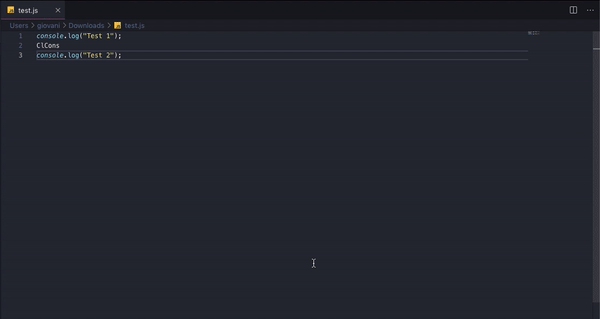

# ClCons
Visual Studio Code extension for clear console logs in the active editor.

<p align="center">
  
</p>

<p align="center">
  <a href="https://marketplace.visualstudio.com/items?itemName=xxgicoxx.clcons">
    </a>
  <a href="https://marketplace.visualstudio.com/items?itemName=xxgicoxx.clcons">
    </a>
  <a href="https://marketplace.visualstudio.com/items?itemName=xxgicoxx.clcons">
    </a>
</p>

# Prerequisites
* [Node.js](https://nodejs.org/en/)

# Running
### 1. Build
````
# Install vsce
npm install -g vsce

# Package
vsce package

# Get your version
clcons-[VERSION].vsix
````

### 2. Run
````
# Install dependencies
npm install

# Start
F5 to run
````

# Built With
* [Node.js](https://nodejs.org/en/)

# Authors
* [xxgicoxx](https://github.com/xxgicoxx)

# Acknowledgments
* [FlatIcon](https://www.flaticon.com/)